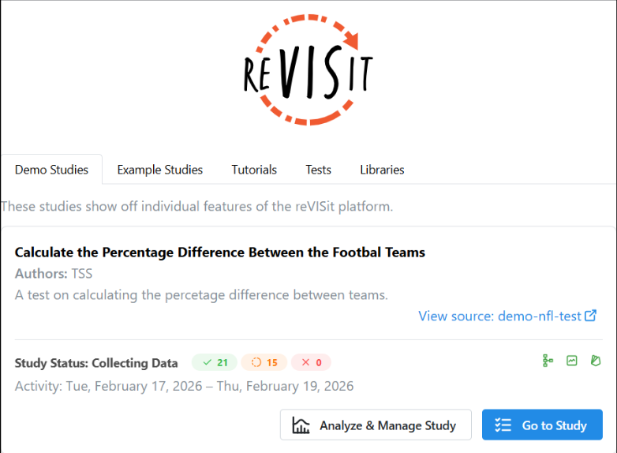
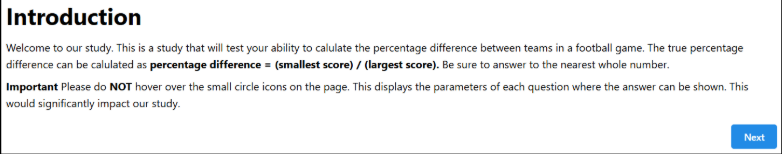
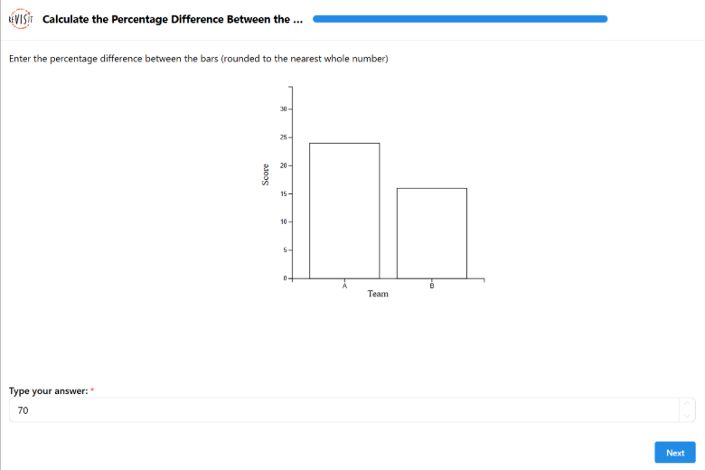
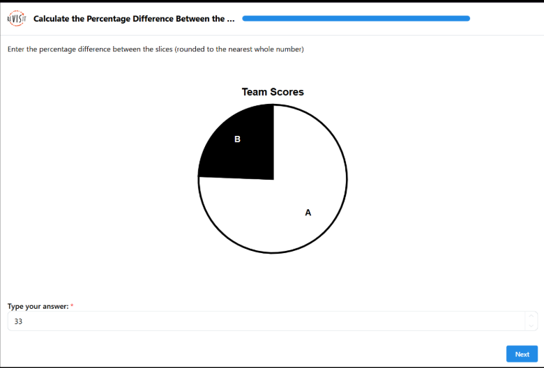
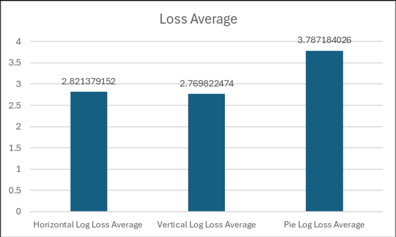
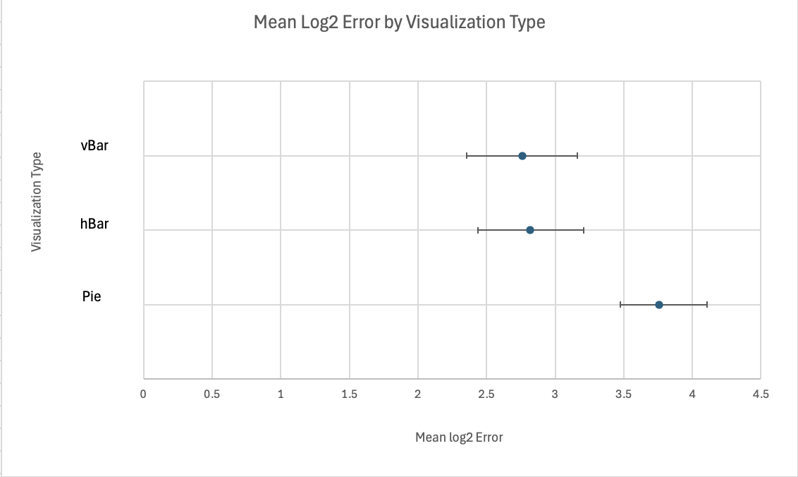
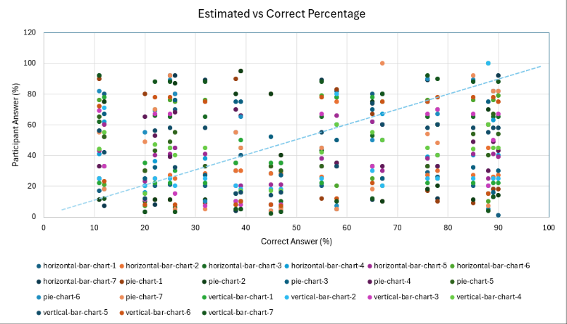

**Link:** https://tacheampong.github.io/revisit-study-nfl/
**Dataset:** NFL Scores
**Description:** This is a study that tests each participant's ability to calculate the percentage difference between two team scores in a football game. This study includes three visualizations: vertical bar charts, horizontal bar charts, and pie charts. For each chart, 7 questions were asked, making the total number of question 21 for the study. All trials represent a random game from the NFL dataset between 2018 and 2023. The parameters include the id of the game, the home/away team name and score, the week, and the score difference. To ensure there was variation in our data, we opted to use the percentage difference instead of a generic absolute difference between scores. 

**Experiment Images:**

This is the survey welcome page that a participant sees right before they press the blue “Go to Study” button to start our survey.

This is the introduction/rules page that participants see once starting the survey, but right before they start answering questions.

The next 3 images are the different types of charts we made. The blue bar is full as the survey is completed, but when a participant is doing the survey, the bar fills in as they go further along. The participant answers by typing in the text box and then pressing the next button to move on.

This is one of the Vertical Bar Charts we have made.

This is one of the Horizontal Bar Charts we have made.

This is one of the Pie Charts we have made.

**Data Analytics:**

**Log Loss Average Visualization**

Image of each average log loss for each chart type.

**Log Loss Analysis**

Based on the visualization we can see there is a marginal difference between horizontal and vertical bar charts. However, there is a noticeable difference between bar charts and pie charts with the difference being roughly 1. 

**Mean Log2 Error Visualization**

Image of the mean log2 error for each visualization type, with the dot being the mean and the error bars displaying the lower and upper error bounds.

**Mean Log2 Error Analysis**

The results from this visualization indicate clear differences in perceptual accuracy across visualization types. Vertical bar charts (vBar) exhibit the lowest mean log2 error, suggesting that participants were most accurate when looking at this visualization. Horizontal bar charts (hBar) show slightly higher mean error than vertical bar charts but still perform much better than pie charts. Pie charts have the highest mean log2 error, demonstrating that participants were least accurate when estimating values from this visualization type. The confidence intervals of both bar charts are pretty similar and overlap, but again, they are much better than pie charts, which do not overlap at all.

**Estimated vs Correct Percentage Visualization**

Image of each answer color coded by chart type and filterable by participant ID.

**Scatterplot Analysis**

The "Estimated vs Correct Percentage" scatter plot illustrates the accuracy of participant responses. A color-coded legend distinguishes each chart which allows us to identify the easiest and hardest charts for the participants. A blue line indicates the overall trend (correct answer).

**Technical Achievements:**

Theresa
- Refactoring revisits code to include an NFL study in the the repo
- Deployed study and connected to firebase
- Used excel to calculate the absolute loss, log base loss, log base averages, and log base chart averages w. visualization
- Created a vertical bar chart using d3

Shevlin
- Created a horizontal bar chart using d3, and pushed it to its own branch I created
- Edited the config.json file for the horizontal bar chart questions
- Parsed the json file with participant responses to create a csv file
- Cleaned the csv file so it is ready to download as an excel and perform needed calculations
- Using the excel file with the loss calculations, used bootstrapped 95% confidence intervals for error upper and lower bounds and then implemented into an excel visualization

Shaniya
- Changed the forked revisit repo to make a branch for questions and answer key to all pie chart questions
- Create a pie chart using d3
- Used excel to make the estimated vs correct percentage chart. To make said chart, I had to rearrange the dataset so all needed data is used.

**Design Achievements:**

Theresa
- Changed the sequential ordering of the questions to be random and the introduction to be fixed
- Updated the introduction to include instructions on how to conduct the study

Shevlin
- Edited the horizontal bar chart to mirror the same dimensions as the vertical bar chart to make them as similar to each other as possible, so any differences do not affect the study
- Updated introduction with a disclaimer message
- Designed the scatter plot where I had to create the dots based on mean log2 error, add only horizontal error bars that represent the lower and upper error bounds, modify the axes, especially the vertical axis, which had to be encoded 1, 2, and 3, so the visualizations are displayed top down smallest mean to largest. Then those numbers had to be manually changed to visualization type instead of the number. 

Shaniya
- The lines in the pie charts were thickened during the black-and-white conversion to improve visual impact and ensure high visibility against a white background. This deliberate choice increased contrast and definition, preventing segments from fading and maintaining data clarity.
- The scatterplot visualization uses a style and color-mapping technique to clearly differentiate the comprehensive range of data points and categories, enabling a nuanced interpretation of relationships. A blue trend line highlights the difference (or closeness) between individual answers and the correct ones.

